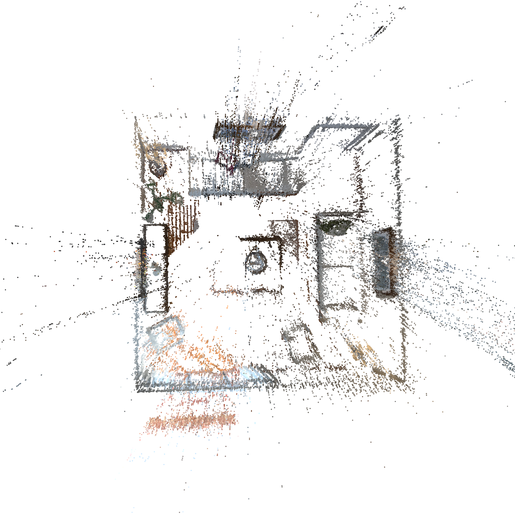

# synpts-pytorch

This repository contains a reference implementation of the algorithms described in the ECCV 2020 paper ["Deep View Synthesis from Colored 3D Point Clouds"](https://www.ecva.net/papers/eccv_2020/papers_ECCV/papers/123690001.pdf).


## Introduction
Given a colored 3D point cloud, we aim to synthesize the corresponding realistic image from a specific view point.
An example is illustrated bellow:

- generate a point cloud from keyframes of a video sequence using [DSO](https://github.com/JakobEngel/dso).



- synthesize from different view points
 


## Dataset
- SUN3D dataset re-orgnized by [DeMoN](https://lmb.informatik.uni-freiburg.de/people/ummenhof/depthmotionnet/).
- ICL-NUIM synthesis dataset, the example data is available (700M) [here](https://drive.google.com/file/d/1sqoSOMFt6MlIJvcEK70b14EO1cQeZ8WG/view?usp=sharing)
- [invsfm](https://github.com/francescopittaluga/invsfm) dataset generated from NYU-V2, the demo data can be download (11G) [here](https://drive.google.com/open?id=1StpUiEauckZcxHZeBzoq6L2K7pcB9v3E).


## Quick Start.

### Install Dependencies
- PyTorch=1.2
- opencv-python
- numpy

### Install PointNet++
```
cd models/pointnet2
python setup.py install
```

### Test on invsfm and ICL-NUIM
```
python inv_icl_test.py --mode test --dataset dataset --test_data_dir test_data_files --root_dir dataset_root_dir
```
Check the 'config.py' for more configuration details.

### Train on DeMoN dataset
```
python demon_train.py --mode train --train_data_dir train_data_files --val_data_dir val_data_files --root_dir dataset_root_dir
```
Check the 'config.py' for more configuration details.

### Pre-trained Models
First download the pre-trained models [here](https://drive.google.com/file/d/1dyfrUVM6K-ID6m4OMprW5BSSeNVC0mhG/view?usp=sharing). 
Then unzip the pre-trained model to folder 'results/demon_4096'.

Note: The model is trained using DeMoN SUN3D indoor dataset, and the training data separation is 'data/filenames/demon_train.txt'. 

## Citation
If you use this code/model for your research, please cite the following paper:
```
@misc{song2020,
    title={Deep View Synthesis from Colored 3D Point Clouds},
    author={Zhenbo Song and Wayne Chen and Dylan Campbell and Hongdong Li},
    year={2020},
}
```


## References
The code is based on the ['EdgeConnect: Generative Image Inpainting with Adversarial Edge Learning'](https://github.com/knazeri/edge-connect)

The PointNet++ impletementation is from [Pointnet2.PyTorch](https://github.com/sshaoshuai/Pointnet2.PyTorch)

